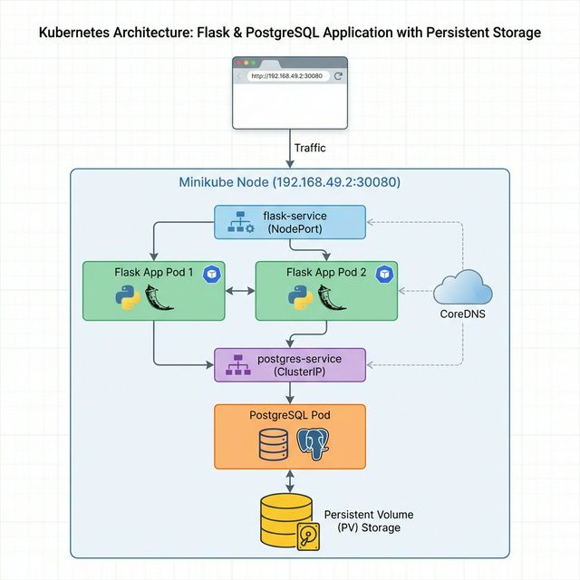

# Flask User Registration App with Kubernetes

**Learn how user requests flow through Kubernetes**: Browser → NodePort Service → Flask Pods → ClusterIP Service → PostgreSQL Pod → Persistent Storage.



## 📋 Features

- **User Registration Form** - Collect name, email, and gender
- **PostgreSQL Database** - Persistent data storage with PVC
- **Beautiful UI** - Modern gradient design with responsive layout
- **Kubernetes Deployment** - Scalable with 2 Flask replicas
- **Crash Recovery** - Automatic pod restart and data persistence
- **Docker Image** - Available on GitHub Container Registry

## 🏗️ Architecture

```
┌─────────────────────────────────────────────┐
│  Minikube Cluster                           │
│                                             │
│  ┌─────────────────────────────────────┐   │
│  │ Flask App (2 replicas)              │   │
│  │ Port: 5000 → NodePort: 30080        │   │
│  └──────────────┬──────────────────────┘   │
│                 ↓                           │
│  ┌─────────────────────────────────────┐   │
│  │ PostgreSQL (1 replica)              │   │
│  │ Port: 5432 (ClusterIP)              │   │
│  │ Storage: 500Mi PVC                  │   │
│  └─────────────────────────────────────┘   │
└─────────────────────────────────────────────┘
```

## 📦 What We Built

### 1. Flask Application (`app.py`)
- User registration endpoint (`/register`)
- Main page showing registered users (`/`)
- Info page (`/info`)
- Automatic database table creation
- Environment variable support for Kubernetes

### 2. Docker Container
- **Base Image:** `python:latest`
- **Image Tag:** `ghcr.io/vishal43770/flask-app:v1`
- **Registry:** GitHub Container Registry (GHCR)

### 3. Kubernetes Manifests
- **Flask Deployment** - 2 replicas for high availability
- **PostgreSQL Deployment** - Single instance with PVC
- **Flask Service** - NodePort (30080) for external access
- **PostgreSQL Service** - ClusterIP for internal communication
- **PVC** - 500Mi persistent storage for database

## 🚀 Complete Setup Procedure

### Prerequisites

```bash
# Install required tools
sudo apt update
sudo apt install docker.io kubectl

# Install Minikube
curl -LO https://storage.googleapis.com/minikube/releases/latest/minikube-linux-amd64
sudo install minikube-linux-amd64 /usr/local/bin/minikube

# Install GitHub CLI (for repo creation)
sudo apt install gh
```

### Step 1: Project Setup

```bash
# Create project directory
mkdir flask-k8s-app
cd flask-k8s-app

# Create virtual environment
python3 -m venv venv
source venv/bin/activate

# Install dependencies
pip install flask psycopg2-binary
```

### Step 2: Create Application Files

Create the following files:

**`app.py`** - Flask application (see repository)  
**`requirements.txt`** - Python dependencies  
**`Dockerfile`** - Container image definition  
**`templates/index.html`** - Registration form UI  
**`templates/info.html`** - Info page  

### Step 3: Create Kubernetes Manifests

Create `k8s/` directory with:

- `postgres-pvc.yaml` - Persistent volume claim (500Mi)
- `postgres-deployment.yaml` - PostgreSQL deployment
- `postgres-service.yaml` - PostgreSQL ClusterIP service
- `flask-deployment.yaml` - Flask app deployment (2 replicas)
- `flask-service.yaml` - Flask NodePort service (30080)

### Step 4: Start Minikube

```bash
# Start Minikube cluster
minikube start

# Verify Minikube is running
minikube status

# Set Docker environment to use Minikube's Docker
eval $(minikube docker-env)
```

### Step 5: Build Docker Image

```bash
# Fix Docker credential issues (if needed)
cat > ~/.docker/config.json << 'EOF'
{
  "auths": {}
}
EOF

# Build image inside Minikube
docker build -t flask-user-app:v1 .

# Verify image
docker images | grep flask
```

### Step 6: Deploy to Kubernetes

```bash
# Apply all Kubernetes manifests
kubectl apply -f k8s/

# Watch pods start (wait until all are Running)
kubectl get pods -w

# Check all resources
kubectl get all

# Verify PVC is bound
kubectl get pvc
```

### Step 7: Access the Application

```bash
# Get service URL (without tunnel)
minikube service flask-service --url

# Output example: http://192.168.58.2:30080

# Open in browser or curl
curl http://192.168.58.2:30080
```

**Access directly:** `http://192.168.58.2:30080` (your Minikube IP may vary)

### Step 8: Push to GitHub Container Registry

```bash
# Fix Docker config (remove Windows credential helper)
cat > ~/.docker/config.json << 'EOF'
{
  "auths": {}
}
EOF

# Build with GHCR tag
docker build -t ghcr.io/vishal43770/flask-app:v1 .

# Login to GitHub Container Registry
echo "YOUR_GITHUB_TOKEN" | docker login ghcr.io -u YOUR_USERNAME --password-stdin

# Push image
docker push ghcr.io/vishal43770/flask-app:v1
```


## 🧪 Testing

### Test User Registration

1. Open `http://192.168.58.2:30080` in browser
2. Fill out the form (Name, Email, Gender)
3. Click "Register"
4. User appears in the table below

### Test Crash Recovery

```bash
# Kill Flask pods
kubectl delete pod -l app=flask-app --force

# Watch pods restart
kubectl get pods -w

# Refresh browser - app still works ✅

# Kill database pod
kubectl delete pod -l app=postgres --force

# Wait for pod to restart (~1 minute)
kubectl get pods -w

# Refresh browser - all users still there! ✅
# This proves PVC is working!
```

### Test Scaling

```bash
# Scale Flask app to 5 replicas
kubectl scale deployment flask-app --replicas=5

# Verify
kubectl get pods -l app=flask-app

# Scale back down
kubectl scale deployment flask-app --replicas=2
```

## 📊 Useful Commands

### View Logs

```bash
# Flask app logs
kubectl logs -l app=flask-app --tail=50

# PostgreSQL logs
kubectl logs -l app=postgres --tail=50

# Follow logs in real-time
kubectl logs -f -l app=flask-app
```

### Debugging

```bash
# Describe pod (shows events and errors)
kubectl describe pod <pod-name>

# Get pod details
kubectl get pods -o wide

# Execute commands inside pod
kubectl exec -it <pod-name> -- bash

# Check database inside PostgreSQL pod
kubectl exec -it <postgres-pod> -- psql -U postgres -d userdb
```

### Cleanup

```bash
# Delete all Kubernetes resources
kubectl delete -f k8s/

# Stop Minikube
minikube stop

# Delete Minikube cluster
minikube delete

# Stop local PostgreSQL (if running)
docker stop postgres-local
docker rm postgres-local
```

## 🔧 Troubleshooting

### Issue: "relation 'users' does not exist"

**Solution:** Ensure `init_db()` is called at module level in `app.py`, not just in `if __name__ == '__main__'`

### Issue: Pods stuck in "ImagePullBackOff"

**Solution:** 
```bash
# Ensure image exists in Minikube's Docker
eval $(minikube docker-env)
docker images | grep flask-user-app

# Rebuild if needed
docker build -t flask-user-app:v1 .
```

### Issue: Can't access app on NodePort

**Solution:**
```bash
# Get correct Minikube IP
minikube ip

# Use IP with NodePort 30080
# Example: http://192.168.58.2:30080
```

### Issue: Database connection failed

**Solution:**
```bash
# Check PostgreSQL pod is running
kubectl get pods -l app=postgres

# Check service exists
kubectl get svc postgres-service

# Verify environment variables in Flask pod
kubectl exec -it <flask-pod> -- env | grep DB
```

## 📁 Project Structure

```
flask-k8s-app/
├── app.py                          # Flask application
├── Dockerfile                      # Docker image definition
├── requirements.txt                # Python dependencies
├── README.md                       # This file
├── .gitignore                      # Git ignore rules
├── templates/
│   ├── index.html                  # Main page with form
│   └── info.html                   # Info page
└── k8s/
    ├── postgres-pvc.yaml           # Persistent volume claim
    ├── postgres-deployment.yaml    # PostgreSQL deployment
    ├── postgres-service.yaml       # PostgreSQL service
    ├── flask-deployment.yaml       # Flask app deployment
    └── flask-service.yaml          # Flask app service
```

## 🌐 Deployed Resources

- **Docker Image:** `ghcr.io/vishal43770/flask-app:v1`
- **GitHub Repo:** `https://github.com/Vishal43770/minikube` (Private)
- **Application URL:** `http://192.168.58.2:30080` (Minikube NodePort)

## 🎯 Key Learnings

1. **PVC Importance** - Without PersistentVolumeClaim, database data is lost on pod restart
2. **Service Discovery** - Pods communicate using service names (e.g., `postgres-service`)
3. **Environment Variables** - Use env vars for configuration in Kubernetes
4. **Docker Context** - Use `eval $(minikube docker-env)` to build images inside Minikube
5. **Crash Recovery** - Kubernetes automatically restarts failed pods
6. **Scaling** - Easy to scale stateless apps (Flask) horizontally

## 📚 Related Documentation

- [Kubernetes Documentation](https://kubernetes.io/docs/)
- [Minikube Guide](https://minikube.sigs.k8s.io/docs/)
- [Flask Documentation](https://flask.palletsprojects.com/)
- [PostgreSQL on Kubernetes](https://kubernetes.io/docs/concepts/storage/persistent-volumes/)


**Built with:** Flask • PostgreSQL • Docker • Kubernetes • Minikube
