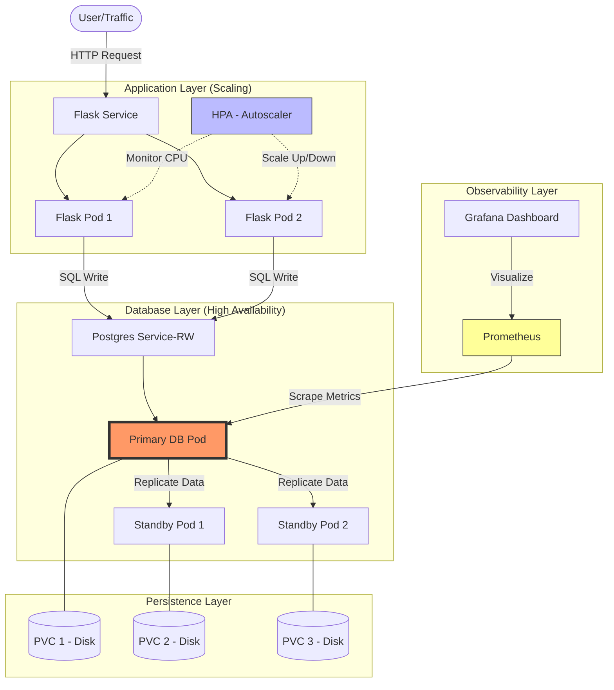

# 🚀 Enterprise-Grade Flask App on Kubernetes

A production-ready Flask application demonstrating **High Availability (HA)**, **Autoscaling (HPA)**, **Persistence**, and **Observability** on Kubernetes.


## 🏗️ How it Works (The Flow)

When a user interacts with this app, here is the journey of their request:



### The 7-Step Project Flow
1.  **User** hits the **Flask Service**.
2.  **Traffic High?** → **HPA** spins up more **Flask Pods** automatically.
3.  **Flask Pods** talk to the **Postgres Service (RW)**.
4.  **Postgres Service** always points to the **Primary Pod** (The Leader).
5.  **Primary Pod** writes data to **PVC 1** (Disk) AND sends it to **Standby Pods**.
6.  **Standby Pods** write that data to **PVC 2** and **PVC 3** to stay in sync.
7.  **Primary Fails?** → A **Standby** is promoted to **Primary** instantly. No data is lost!

---

## 🛠️ Tools & Methods Used

### The Add-ons (Our Tools)
- **CloudNativePG:** The "Robot Manager" for the database (Failover, HA, Backups).
- **Prometheus:** The metrics collector (The "Pulse Monitor").
- **Grafana:** The dashboard UI (The "Clinical Screen").
- **Metrics Server:** Measures CPU/RAM for the Autoscaler to work.

### The Methods (Our Rules)
- **PVC (Persistence):** External "Hard Drive" so data survives pod crashes.
- **Replication (HA):** "Spare Engine" logic. One leader, many standby followers.
- **HPA (Scaling):** "Extra Staff" logic. Adds web pods when users increase.
- **RW Service:** Smart traffic sign that always finds the current DB leader.
- **PDB (Safety):** Locks that prevent too many pods from being deleted during maintenance.

---

## 🚀 Quick Start (Minikube)

### 1. Start the Environment
```bash
minikube start --driver=docker
eval $(minikube docker-env)
```

### 2. Build the App
```bash
docker build -t flask-user-app:v1 .
```

### 3. Deploy Everything
```bash
# Apply Kubernetes Manifests
kubectl apply -f k8s/
```

### 4. Access the App
```bash
minikube service flask-service --url
```

---

## 📊 Monitoring
Check your DB health and traffic in real-time:
1. Port-forward Grafana: `kubectl port-forward svc/monitoring-grafana 3000:80 -n monitoring`
2. Open `http://localhost:3000` (User: `admin`)
3. View **CloudNativePG** Dashboard for replication status.

---

**Built with:** Flask • PostgreSQL (CloudNativePG) • Docker • Kubernetes (HPA, PVC, HA)
